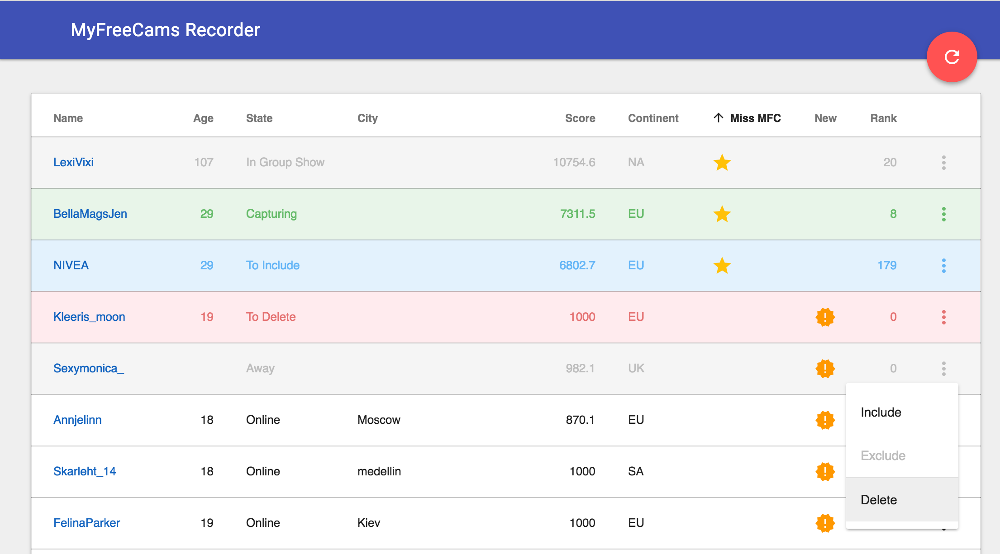

mfc-node
==========

mfc-node lets you follow and record your favorite models' shows on myfreecams.com

This is an attempt to create a script similar to [capturbate-node](https://github.com/sstativa/capturebate-node) based on different pieces of code found on the Internet.



Credits:
* [capturbate-node](https://github.com/sstativa/capturebate-node)
* [MFCAuto](https://github.com/ZombieAlex/MFCAuto)

Want to support?
==========
[](https://ko-fi.com/A320FTJ)

Requirements
==========
[Node.js](https://nodejs.org/download/) used to run mfc-node, hence the name (minimum node version requirement: v9.4).

[ffmpeg](https://www.ffmpeg.org/download.html)

Setup
===========

1. Install [Node.js](https://nodejs.org/download/) (minimum node version requirement: v9.4).
2. Download and unpack the [code](https://github.com/sstativa/mfc-node/archive/master.zip).
3. Open Terminal (macOS) or Command Prompt (Windows) and go into the directory where you unpacked the files.
4. Install requirements by running `npm install` in the same directory as `main.js` is (Windows users have to install [Git](https://git-scm.com/download/win)).
5. Edit `config.yml` file and set desirable values for `captureDirectory`, `completeDirectory`, `modelScanInterval`.
6. Install [ffmpeg](https://www.ffmpeg.org/download.html). For Windows users, copy `ffmpeg.exe` into same directory as `main.js` is.

Running
===========

1. Open Terminal (macOS) or Command Prompt (Windows) and go into the directory where you unpacked the files.
2. Run `node main.js`.
3. Open [http://localhost:9080](http://localhost:9080) in you browser. The list of online models will be displayed with a set of allowed commands for each model:

	* __Include__ - if you want to record the model
	* __Exclude__ - if you don't want to record the model anymore
	* __Delete__ - if you are not interested in the model and want to hide her permanently

> Note: This is not a real-time application. Whenever your __include__, __exclude__ or __delete__ the model your changes will be applied only with the next iteration of `mainLoop` function of the script. `mainLoop` runs every 30 seconds (default value for `modelScanInterval`).

> Note: There is no __auto reload__ feature, you have to reload the list manually (__big red button__), however, keep in mind the script updates the list internally every 30 seconds (`modelScanInterval`), therefore sometimes you'll have to wait 30 seconds to see any updates.

> Note: Be mindful when capturing many streams at once to have plenty of space on disk and the bandwidth available or you’ll end up dropping a lot of frames and the files will be useless.

Converting
===========

There is a simple script to convert `.ts` files. Just edit `convert.yml` file and set proper values for `srcDirectory` (should be the same with `completeDirectory`) and `dstDirectory`, then run `node convert.js` in a separate console window.

For advanced users
===========

There are several special URLs that allow implementing some operations with a model even if she is offline.

__Include__

```
http://localhost:9080/models/include?nm=modelname
http://localhost:9080/models/include?uid=12345678
```

__Exclude__

```
http://localhost:9080/models/exclude?nm=modelname
http://localhost:9080/models/exclude?uid=12345678
```

__Delete__

```
http://localhost:9080/models/delete?nm=modelname
http://localhost:9080/models/delete?uid=12345678
```

Proxy
===========

This is just a Proof of Concept to avoid region block.
To use it you have to start `proxy.js` on some remote server from different region then add a parameter `proxyServer` to your local `config.yml`, for example, `proxyServer: '54.206.109.161:9090'`.

The `main.js` script will try to get models from remote region then merge with the list of models available in your region.

> Note: This is not a real-time application, expect inconsistency.

> Note: '54.206.109.161:9090' from Sydney will be available for tests for a couple days, then will be stopped.